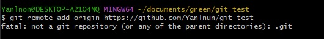
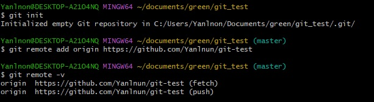
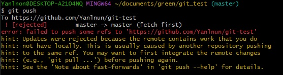
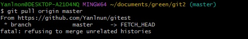
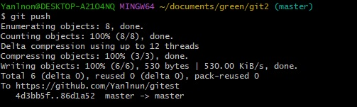
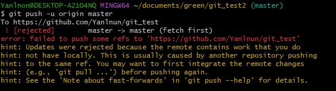
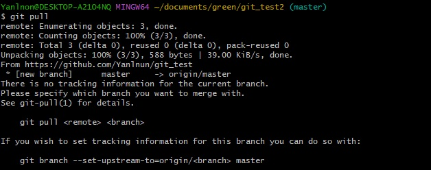
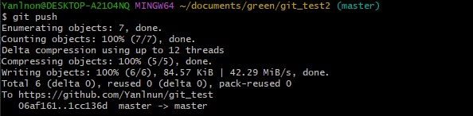
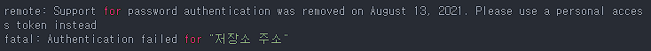
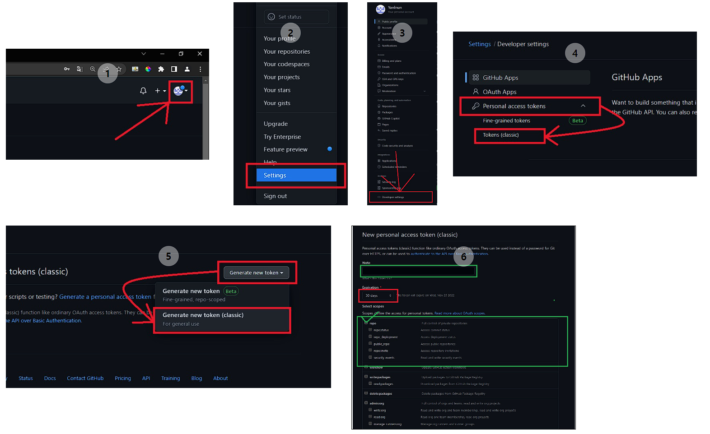

# git remote add 시 발생하는 오류    fatal: not a git repository (or any of the parent directories): .git

    위와 같은 오류는 해당 폴더안에 .git 폴더가 없음을 의미
    git init 으로 해결 가능.

   

# git push 시 발생하는 오류(1)    error: failed to push some refs to '~~~'   hint: updates were rejected because the tip of your current branch is behind

    github 레파지토리 생성 시 readme.md 파일 생성여부란에 체크하면 생기는 오류.
    원격저장소에서의 readme.md -> 로컬 커밋로그에는 없기때문.
    이를 해결하기위해 git pull 사용 

    두개의 commit 히스토리가 서로 관련이 없기 때문에 merge 할 수 없음을 알림.
    기본적으로 merge는 원격저장소(git)와 로컬저장소(pc) 공통으로 가지고있는 commit 지점이 존재해야함.
    여기서 공통된 commit 지점이 없기때문에 pull 명령이 안먹음.
    두 커밋을 강제병합 

            $ git pull origin [@@] --allow-unrelated-histories

    정삭적으로 push됐음을 확인.

    그 밖에도
    $ git push -u origin master --force
    $ git push -u origin +master
    강제 push 하는 방법도 있으나, 데이터 유실이 발생 할 수 있다.
   

# git push 시 발생하는 오류(2)    error: failed to push some refs to '~~~'   hint: updates were rejected because the remote contains work that you do not have locally

    원격저장소(git)에는 있지만, 로컬저장소(pc)에 없는 파일이 존재할경우 발생.
    " git pull "로 한번 업데이트를 해준다음 push 가능

   

# remote: Support for apssword autentication was removed on ~~~    fatal: Autentication failed for '~~~'

    깃허브에서 personal access token을 사용하도록 바꾸면서 발생하는 오류
    username, password를 정확하게 입력하더라도 토큰 인증 에러 발생.
 
    
    해결 방법은 다음과 같음.

    note : 토근에 대한 설명
    Expiration : 토큰 만료일(기간 설정)
    일반적으로 repo 부분만 체크하나 
    필요 시 아 래 항목들 추가 선택 설정가능.