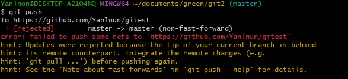

# git remote add -> fatal: not a git repository (or any of the parent directories): .git

위와 같은 오류는 해당 폴더안에 .git 폴더가 없음을 의미

git init 으로 해결 가능.

   

# git push -> error: failed to push some refs to '~~~'   hint: updates were rejected because the tip of your current branch is behind

보통 git clone 이후에 발생하는 경우가 많으며,

원격저장소(git)에는 있지만,   로컬저장소(pc)에 없는 파일이 존재할경우 발생.

<strong>" git pull "</strong> 로 한번 업데이트를 해준다음 push 가능

